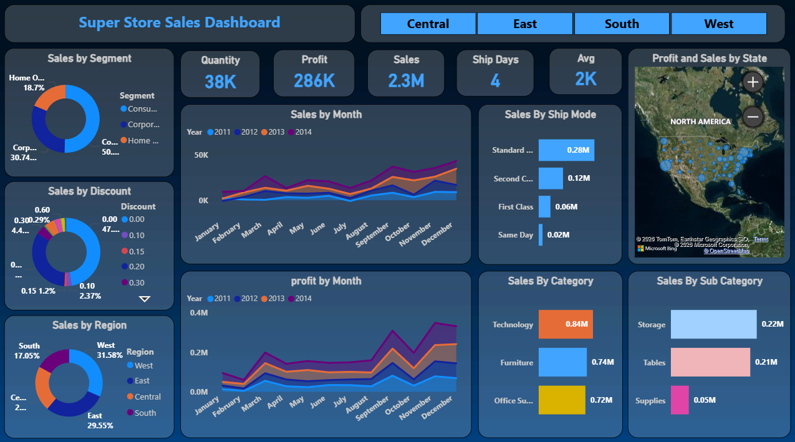
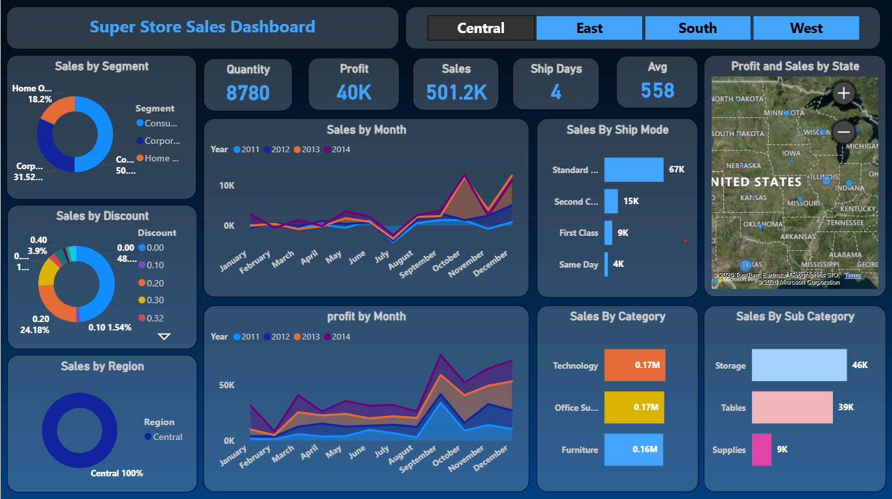
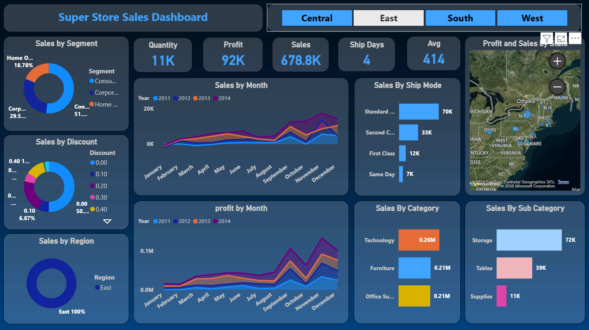
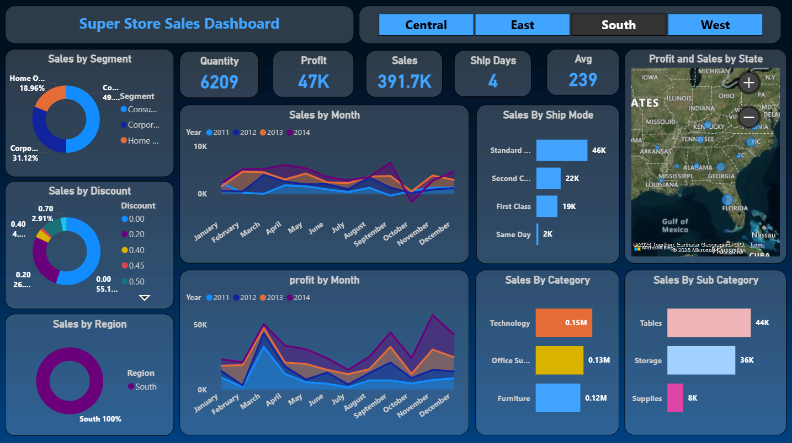
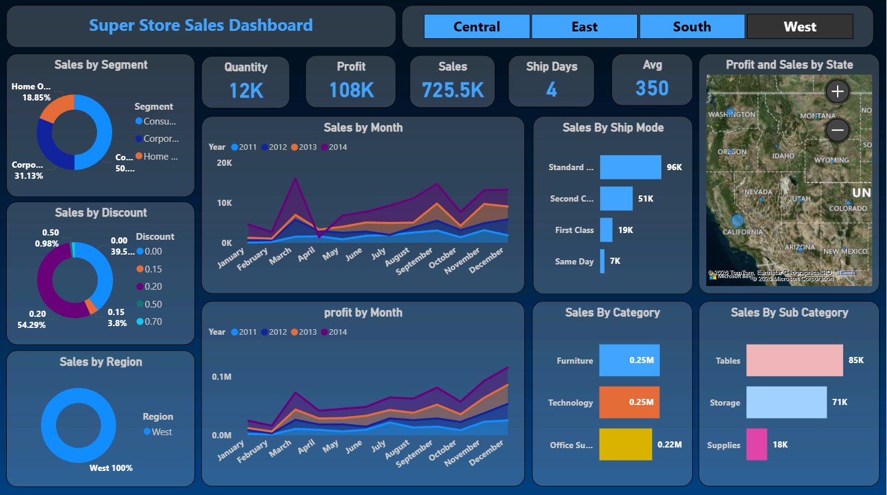
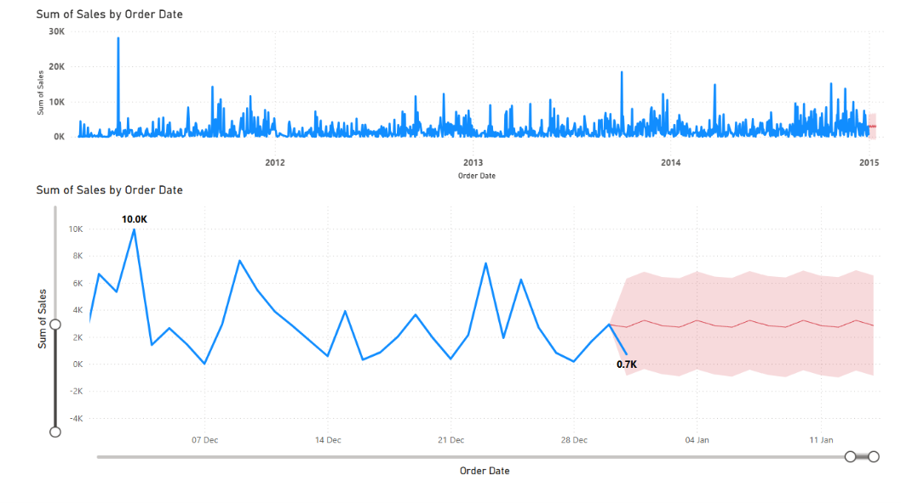

# 🛒 Super Store Sales Dashboard

An interactive **Power BI Sales Dashboard** built on the popular Superstore dataset, providing comprehensive insights into sales, profit, shipping, and regional performance across four US regions.

---

## 📊 Dashboard Overview

The dashboard features region-based filtering (Central, East, South, West) and displays key KPIs alongside rich visualizations for data-driven decision making.

### 🔢 Key Metrics at a Glance (All Regions Combined)

| Metric | Value |
|---|---|
| 📦 Total Quantity | 38K |
| 💰 Total Profit | 286K |
| 💵 Total Sales | 2.3M |
| 🚚 Avg Ship Days | 4 |
| 📈 Avg Order Value | 2K |

---

## 🗺️ Regional Dashboards

### 🌐 All Regions — Overview


> Combined view showing sales by region breakdown (West: 31.58%, East: 29.55%, South: 17.05%, Central: ~22%)

---

### 📍 Central Region


| Metric | Value |
|---|---|
| Quantity | 8,780 |
| Profit | 40K |
| Sales | 501.2K |
| Top Category | Technology (0.17M) |
| Top Sub-Category | Storage (46K) |

---

### 📍 East Region


| Metric | Value |
|---|---|
| Quantity | 11K |
| Profit | 92K |
| Sales | 678.8K |
| Top Category | Technology (0.26M) |
| Top Sub-Category | Storage (72K) |

---

### 📍 South Region


| Metric | Value |
|---|---|
| Quantity | 6,209 |
| Profit | 47K |
| Sales | 391.7K |
| Top Category | Technology (0.15M) |
| Top Sub-Category | Tables (44K) |

---

### 📍 West Region


| Metric | Value |
|---|---|
| Quantity | 12K |
| Profit | 108K |
| Sales | 725.5K |
| Top Category | Furniture & Technology (0.25M each) |
| Top Sub-Category | Tables (85K) |

---

## 📉 Sales Forecasting



The dashboard includes a **time-series forecast** for sales using Power BI's built-in analytics, showing:
- Historical daily sales from 2011–2014
- Zoomed-in view for end-of-year and early January trends
- Shaded confidence band for predictions (forecast value: ~0.7K)

---

## 📌 Dashboard Features

- **Region Filters** — Toggle between Central, East, South, and West with one click
- **Sales by Segment** — Donut chart: Consumer (~50%), Corporate (~31%), Home Office (~19%)
- **Sales by Discount** — Discount tier distribution across all orders
- **Sales by Region** — Regional contribution breakdown
- **Sales by Month** — Multi-year (2011–2014) area/line chart
- **Profit by Month** — Year-over-year monthly profit trends
- **Sales by Ship Mode** — Standard Class, Second Class, First Class, Same Day
- **Sales by Category** — Technology, Furniture, Office Supplies
- **Sales by Sub-Category** — Tables, Storage, Supplies
- **Profit & Sales by State** — Bing Maps visual with geographic drill-down
- **Sales Forecasting** — Predictive analytics with confidence intervals

---

## 📁 Project Files

```
📦 SuperStore-Sales-Dashboard
 ┣ 📊 sales_powerbi.pbix       # Power BI Desktop file
 ┣ 📄 Superstore.csv           # Raw dataset
 ┣ 🖼️ all_region.png  # All-regions overview screenshot
 ┣ 🖼️ central.png              # Central region screenshot
 ┣ 🖼️ east.png                 # East region screenshot
 ┣ 🖼️ south.png                # South region screenshot
 ┣ 🖼️ west.png                 # West region screenshot
 ┣ 🖼️ sum_of_sales.png  # Forecasting view screenshot
 ┗ 📄 README.md
```

---

## 🛠️ Tools & Technologies

| Tool | Purpose |
|---|---|
| **Power BI Desktop** | Dashboard creation & visualization |
| **DAX** | Calculated measures and KPIs |
| **Power Query (M)** | Data transformation & cleaning |
| **Bing Maps** | Geographic profit/sales visual |
| **Superstore Dataset** | Sales data (2011–2014) |

---

## 🚀 Getting Started

1. **Clone this repository**
   ```bash
   git clone https://github.com/harshitaswal04/superstore-sales-dashboard.git
   cd superstore-sales-dashboard
   ```

2. **Open the Power BI file**
   - Install [Power BI Desktop](https://powerbi.microsoft.com/desktop/) (free)
   - Open `sales_powerbi.pbix`

3. **Refresh the data** *(if needed)*
   - Go to **Home → Transform Data**
   - Update the `Superstore.csv` file path in Power Query
   - Click **Close & Apply**

4. **Explore the dashboard**
   - Use the **Central / East / South / West** buttons to filter by region
   - Interact with any visual to cross-filter the entire dashboard

---

## 📊 Dataset Information

The `Superstore.csv` dataset contains retail sales records with the following key fields:

| Column | Description |
|---|---|
| Order Date | Date of order placement |
| Ship Date | Date of shipment |
| Ship Mode | Shipping method used |
| Segment | Customer segment |
| Region | US sales region |
| Category | Product category |
| Sub-Category | Product sub-category |
| Sales | Revenue generated |
| Quantity | Units sold |
| Discount | Discount applied |
| Profit | Profit earned |

---

## 📸 Dashboard Screenshots

| Region | Preview |
|---|---|
| All Regions |  |
| Central |  |
| East |  |
| South |  |
| West |  |

---

## 🤝 Contributing

Contributions and suggestions are welcome! Feel free to:
- Open an **Issue** for bugs or feature requests
- Submit a **Pull Request** with improvements

---

## 📄 License

This project is open-source and available under the [MIT License](LICENSE).

---

## 👤 Author

**HARSHIT ASWAL**  
📧 mailto://harshitaswal04@gmail.com 
🔗 [LinkedIn](https://www.linkedin.com/in/harshit-aswal) | [GitHub](https://github.com/harshitaswal04)

---

⭐ *If you found this project helpful, please give it a star!*
